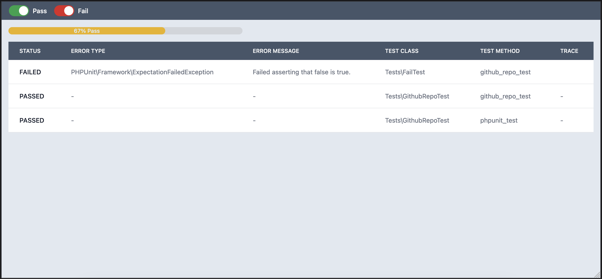

# PHP Selenium Testing Framework

Welcome to the PHP Selenium Testing Framework project! This framework leverages Selenium and PHPUnit to automate browser testing for PHP applications. Below you'll find detailed information on how to set up, configure, and run the tests, as well as some tips to make the most of this powerful testing tool.

## Table of Contents

- [Introduction](#introduction)
- [Features](#features)
- [Requirements](#requirements)
- [Installation](#installation)
- [Configuration](#configuration)
- [Usage](#usage)
- [Writing Tests](#writing-tests)
- [Running Tests](#running-tests)
- [Project structure](#project-structure)
- [Screenshots](#screenshots)
- [Contributing](#contributing)
- [License](#license)

## Introduction

This framework provides a robust environment for automated browser testing using Selenium WebDriver. It supports both parallel and sequential testing, ensuring optimal performance and resource utilization. Additionally, the framework includes webhook integration for sending HTML or JSON test reports, and provides the capability to save HTML reports directly on the server.

## Features

- **Automated Browser Testing**: Run your browser-based tests automatically.
- **Selenium WebDriver Integration**: Utilize the power of Selenium WebDriver for browser automation.
- **PHPUnit Support**: Write and manage your tests using PHPUnit.
- **Docker Compatibility**: Easily start Selenium using Docker.
- **Automatic Test Discovery**: Automatically discover and run tests located in the `tests` directory.
- **Graceful Shutdown**: Clean up Selenium sessions on script termination or interruption.
- **Logs**: Support of terminal, xml or json logging
- **Parallel Testing**: Run tests in parallel to optimize testing time and resources.
- **Webhook Integration**: Send HTML or JSON reports via webhooks.
- **HTML Reports**: Generate and save HTML reports on the server for detailed test analysis.

## Requirements

- PHP 7.4 or higher
- Composer
- Docker

## Installation

1. **Clone the repository:**
```bash
git clone https://github.com/kirilkirkov/PHP-Selenium-Testing-Framework.git
```
2. **Install dependencies:**
```bash
cd php-selenium-testing-framework
composer install
```
3. **Start Selenium with Docker:**
```bash
docker run -d -e SE_NODE_MAX_SESSIONS=10 -p 4444:4444 -p 5900:5900 --shm-size=2g --restart=always selenium/standalone-firefox:latest
```

<p>SE_NODE_MAX_SESSIONS is important for maximum count of paralell tests.</p>

## Configuration
Ensure you have the necessary configuration files:

- **config.php**: Add your specific configurations.
- **helpers.php**: Helper functions for your tests.

## Usage

1. **Run the test script:**
```bash
php run-tests.php
```

2. **Interrupt the tests:**
Press Ctrl+C to stop the tests gracefully. This will ensure that the Selenium session is properly terminated.

## Writing Tests
Create your test classes in the tests directory. Test classes should follow the naming convention *Test.php and should be placed under the Tests namespace. Each separate test method should ends with suffix "_test".

Example test class:
```php
<?php
declare(strict_types=1);

namespace Tests;

// PHP-WebDriver
use Facebook\WebDriver\WebDriverBy;
use Facebook\WebDriver\WebDriverExpectedCondition;
// PHPUnit
use PHPUnit\Framework\TestCase;

class SampleTest extends TestCase
{
    private $driver;

    public function __construct(RemoteWebDriver $driver)
    {
        $this->driver = $driver;
    }

    public function beforeEachTest()
    {
        // Setup code before each test
    }

    public function afterEachTest()
    {
        // Cleanup code after each test
    }

    public function example_test()
    {
        // Your test code
    }
}
```

## Running Tests
Execute the tests using the command provided in the [Usage](#usage) section. The framework will automatically discover and run all tests matching the pattern *Test.php in the tests directory.

## Real-time Monitoring
You can watch the tests in real-time using a VNC viewer. The Selenium Docker image allows VNC connections with the following details:

- **Host:** localhost
- **Port:** 5900
- **Password:** secret

To connect using a VNC viewer:

- Download and install a VNC viewer (e.g., <a href="https://www.realvnc.com/en/">RealVNC</a>, <a href="https://tigervnc.org/">TigerVNC</a>).
- Open the VNC viewer and connect to localhost:5900.
- When prompted, enter the password secret.

This allows you to observe the browser interactions as the tests are being executed.

## Project structure
```bash
PHP-Selenium-Testing-Framework-main/
├── .gitignore               # Specifies files and directories that should be ignored by Git
├── LICENSE                  # License file for the project
├── README.md                # Project description and instructions
├── composer.json            # Composer configuration file containing project dependencies and metadata
├── config.php               # Configuration file for the project
├── helpers.php              # Helper functions file
├── run-tests.php            # Script to run the tests
├── src/                     # Directory containing the main source code of the project
│   ├── CmdMessages.php          # File with command messages
│   ├── HtmlReport.php           # File for generating HTML reports
│   ├── ParallelTesting.php      # File for parallel test execution
│   ├── Response.php             # File for handling responses
│   ├── ResultsContainer.php     # File for the results container
│   ├── TestsParser.php          # File for parsing test files
│   ├── TestsRunner.php          # File for running tests
│   └── Webhook.php              # File for webhooks
└── tests/                   # Directory containing test files
    ├── FailTest.php             # Sample example file for a failing test
    └── GithubRepoTest.php       # Sample example file for testing a GitHub repository
```

## Screenshots
<p>HTML Report:</p>


## Contributing
We welcome contributions! Please follow these steps to contribute:

- Fork the repository.
- Create a new branch for your feature or bugfix.
- Commit your changes.
- Push your branch and create a Pull Request.

## License
This project is licensed under the MIT License. See the <a href="https://github.com/kirilkirkov/PHP-Selenium-Testing-Framework/blob/main/LICENSE">LICENSE</a> file for details.
